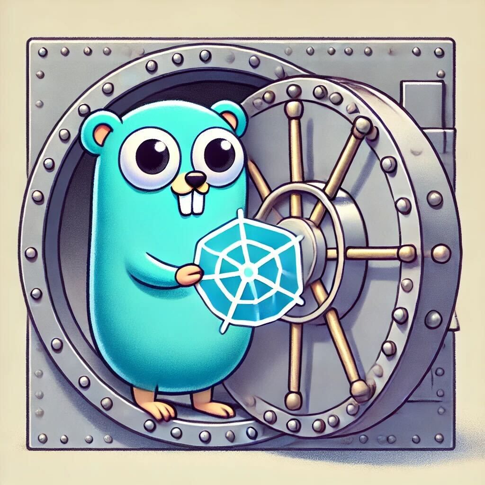

<p align="center">
  
</p>

<h1 align="center">Kube-Save-Restore</h1>

<p align="center">
  <strong>A robust and user-friendly tool for backing up and restoring Kubernetes resources</strong>
</p>

<p align="center">
  <a href="#introduction">Introduction</a> •
  <a href="#features">Features</a> •
  <a href="#installation">Installation</a> •
  <a href="#usage">Usage</a> •
  <a href="#configuration">Configuration</a> •
  <a href="#contributing">Contributing</a> •
  <a href="#license">License</a>
</p>

<p align="center">
  
  
  
</p>

## Introduction

Ever felt like your Kubernetes cluster was a house of cards, one misplaced yaml away from digital chaos? Enter kube-save-restore, your digital superhero cape for the Kubernetes world! This mighty tool swoops in to save the day, backing up your precious resources faster than you can say "kubectl". Whether you're juggling a cozy little cluster or wrangling a Kubernetes behemoth, kube-save-restore's got your back(up). It's like a time machine for your deployments, services, config maps, secrets, and more! - minus the paradoxes and unintended grandfather assassinations. So sit back, relax, and let kube-save-restore be your cluster's personal bodyguard against the forces of data loss and configuration mishaps!

## Features

🔄 **Comprehensive Backup**: Capture deployments, services, config maps, secrets, statefulsets, and more across all namespaces.

🚀 **Seamless Restore**: Restore your Kubernetes resources with ease, ensuring minimal downtime.

🧪 **Dry Run Mode**: Validate backup and restore operations without making actual changes.

⚡ **Concurrent Processing**: Utilize worker pools for efficient handling of multiple resources.

📊 **Customizable Logging**: Configure log levels and output destinations to suit your monitoring needs.

🛠️ **Configuration Flexibility**: Easily configure via flags or environment variables.

🧬 **Automated Testing**: Comprehensive test suite ensuring reliability and stability.

## Installation

### Go Install

```sh
go install github.com/chaoscypher/kube-save-restore@latest
```

### Building from Source

1. Clone the repository:
   ```sh
   git clone git@github.com:ChaosCypher/kube-save-restore.git
   ```

2. Navigate to the project directory:
   ```sh
   cd kube-save-restore
   ```

3. Build the binary:
   ```sh
   go build -o kube-save-restore
   ```

4. Move the binary to your PATH:
   ```sh
   sudo mv kube-save-restore /usr/local/bin/
   ```
## Usage

kube-save-restore offers two primary modes: `backup` and `restore`.

### Backup

To create a backup of your Kubernetes resources:

```sh
kube-save-restore --mode=backup --backup-dir=/path/to/backup --dry-run=false --log-level=info
```
This command will backup all supported resources from all namespaces in your cluster.

### Restore

To restore your Kubernetes resources from a backup:

```sh
kube-save-restore --mode=restore --restore-dir=/path/to/backup --dry-run=true --log-level=debug
```

It's recommended to use the `--dry-run=true` flag first to verify the restore operation before applying changes.

### Additional Options

- Use `--context` to specify a different Kubernetes context.
- Set `--log-file` to save logs to a file instead of stdout.
- Adjust `--log-level` to control the verbosity of logging.

For a full list of options, run:

```sh
kube-save-restore --help
```


## Configuration

kube-save-restore can be configured using command-line flags or environment variables:

| Flag            | Environment Variable | Description                                      |
| --------------- | -------------------- | ------------------------------------------------ |
| `--kubeconfig`  | `KUBECONFIG`         | Path to the kubeconfig file                      |
| `--context`     | `KUBE_CONTEXT`       | Kubernetes context to use                        |
| `--backup-dir`  | `BACKUP_DIR`         | Directory where backups will be stored           |
| `--restore-dir` | `RESTORE_DIR`        | Directory from where backups will be restored    |
| `--mode`        | `MODE`               | Operation mode: `backup` or `restore`            |
| `--dry-run`     | `DRY_RUN`            | Execute a dry run without making any changes     |
| `--log-level`   | `LOG_LEVEL`          | Logging level: `debug`, `info`, `warn`, `error`  |
| `--log-file`    | `LOG_FILE`           | Path to the log file                             |

Environment variables take precedence over command-line flags.

## Contributing

We welcome contributions to kube-save-restore! Here's how you can contribute:

1. **Fork the Repository**: Start by forking the [kube-save-restore repository](https://github.com/chaoscypher/kube-save-restore).

2. **Clone Your Fork**: 
   ```bash
   git clone git@github.com:YourUsername/kube-save-restore.git
   ```

3. **Create a Feature Branch**:
   ```bash
   git checkout -b feature/YourFeature
   ```

4. **Make Your Changes**: Implement your feature or bug fix.

5. **Run Tests**: Ensure all tests pass:
   ```bash
   go test ./...
   ```

6. **Commit Your Changes**:
   ```bash
   git commit -m "Add your feature"
   ```

7. **Push to Your Fork**:
   ```bash
   git push origin feature/YourFeature
   ```

8. **Open a Pull Request**: Go to the original kube-save-restore repository and open a pull request with your changes.

### Coding Standards

- Follow Go best practices and idiomatic Go code style.
- Ensure your code is properly formatted using `gofmt`.
- Write clear, concise commit messages.
- Include tests for new features or bug fixes.
- Update documentation as necessary.

### Reporting Issues

If you find a bug or have a suggestion for improvement:

1. Check the [existing issues](https://github.com/chaoscypher/kube-save-restore/issues) to avoid duplicates.
2. If your issue isn't already listed, [open a new issue](https://github.com/chaoscypher/kube-save-restore/issues/new).
3. Clearly describe the problem or suggestion, including steps to reproduce if applicable.

## License

kube-save-restore is open-source software licensed under the [MIT License](LICENSE).

## Contact

For any inquiries or support, please open an issue on the [GitHub repository](https://github.com/chaoscypher/kube-save-restore).

---

<p align="center">
  Made with ❤️ by <a href="https://github.com/ChaosCypher">ChaosCypher</a>
</p>
